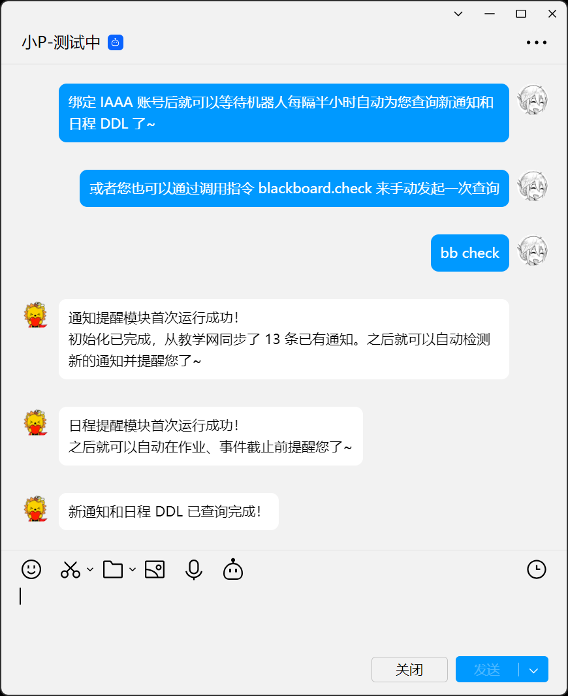

# koishi-plugin-pku-blackboard-watcher

监控 PKU 教学网的 Koishi 插件，机器人定时查询教学网上是否有新通知、将近的 DDL，并向您发送提醒消息~

## 一、项目功能

您是否曾在打开教学网后才发现老师在几天前布置了作业？

您是否常常记挂着课件发没发，隔一会儿就忍不住点开教学网看看，然后望着毫无变动的课件列表暗自神伤？

您是否对发布不太规律的作业容易忘记 DDL，回过神来才发现 DDL 已经逼近？

（至少我是）

在这个项目中，机器人可以在新作业发布时自动向您发送提醒消息，在检测到您有即将截止的作业还没提交时也会提醒您。您还可以自由设置无需提醒的课程、DDL 预警的提前时间量等。




|  | 重要概念说明：<br><br>“通知” 指的是第三个图标对应页面的内容<br>“日程” 指的是第五个图标对应页面的内容 |
| :--------------------------------------: | :--------------------------------------------------------------------------------------------------- |

1. **通知提醒**：检测到教学网收到新通知时，给您发送提醒消息

   - “通知” 包括课程公告、课件、作业等

   - 可以配置每门课程需要提醒的通知类型（比如可以只提醒与作业相关的通知）

   - 如果通知类型是新作业发布，会自动在提醒消息中附带作业要求和截止时间，无需登录教学网即可便捷查看

2. **日程提醒**：检测到教学网有即将到期的未完成作业或事件时，给您发送提醒消息

   - 基于教学网的 “日程表” 功能

   - 可以在教学网上创建自定义事件（比如某课程的作业是线下提交，教学网上没有相关信息，您可以自己在教学网上创建这项日程，机器人同样会在离日程截止还有一定时间时给您发送提醒消息）

   - 可以配置 DDL 预警的提前时间量

   - 如果是还未提交过的作业 DDL，会自动在提醒消息中附带作业要求和截止时间，尽可能节约您的时间

3. **课程别名**：如果课程名称太长或不够亲切，您可以在配置时指定课程的别名，给您发送提醒消息时会使用别名

4. **交互方式**：在社交媒体上与机器人对话就行啦~

## 二、项目结构

**（这部分总结主要由 AI 撰写）**

```
pku-blackboard-watcher/
├── src/
│   ├── commands/
│   │   ├── iaaa.ts
│   │   ├── config.ts
│   │   └── check.ts
│   ├── core/
│   │   ├── blackboard.ts
│   │   ├── notice_handler.ts
│   │   ├── calendar_handler.ts
│   │   └── schedule.ts
│   ├── types.ts
│   ├── database.ts
│   ├── utils.ts
│   └── index.ts
├── package.json
├── tsconfig.json
└── README.md
```

### 入口与配置（`src/`）

- **`index.ts`** - 插件主入口文件，负责初始化数据库、注册命令、启动定时服务

- **`types.ts`** - TypeScript 类型定义，包含所有接口、配置项和数据模型

- **`../package.json`** - 项目配置，定义依赖关系和插件元信息

### 数据库与工具函数（`src/`）

- **`database.ts`** - 数据库模型和操作函数
  - 四张数据表：IAAA 认证、教学网监控配置、通知记录、日程记录
  - CRUD 操作封装，通过 upsert 更新数据防止冲突

- **`utils.ts`** - 工具函数集合
  - 密码加密解密
  - HTML 解析
  - 时间格式转换和处理函数
  - JSON 解析和数据处理

### 核心业务逻辑（`src/core/`）

- **`blackboard.ts`** - 教学网客户端类
  - IAAA 与教学网登录认证
  - 调用 Axios 库发起异步网络请求
  - 手动实现 Cookie 管理，解决跨域问题
  - 通过教学网 API 获取通知和日程数据

- **`notice_handler.ts`** - 通知处理器类
  - 获取和解析教学网通知数据
  - 智能过滤通知类型（作业/课件/公告）
  - 支持课程别名、类型过滤等丰富自定义配置
  - 对新发布的作业自动抓取作业要求和截止时间

- **`calendar_handler.ts`** - 日程处理器类
  - 获取和解析教学网日程数据
  - 在 DDL 前一定时间内发送提醒消息
  - 检测作业提交状态以判断是否需要提醒
  - 支持在教学网上自定义事件，如不在教学网上设置提交入口的作业

- **`schedule.ts`** - 定时任务服务类
  - 使用 cron 插件实现定时调度
  - 批量处理所有用户的检查任务
  - 模拟 session 向用户发送私信通知

### 命令定义与实现（`src/commands/`）

- **`iaaa.ts`** - IAAA 认证信息管理
  - `iaaa.bind` - 绑定北大 IAAA 账号
  - `iaaa.info` - 查看已绑定账号信息
  - 密码加密存储和登录验证

- **`config.ts`** - 教学网监听配置管理
  - `blackboard.config.info` - 显示当前配置详情
  - `blackboard.config.set` - 交互式配置向导
  - 支持课程别名、通知类型、DDL 提前提醒时间等配置

- **`check.ts`** - 用于手动查询（即时）
  - `blackboard.check` - 手动发起一次对新通知和 DDL 的查询

实现了较为清晰的模块化设计，一层层组件几乎形成从下到上的依赖链。
